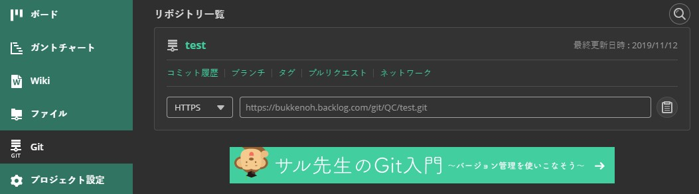

# bukkenoh_script_updated

This is after you're qualified or selected as a member of the Bukkenoh Team.

##to setup bukkenoh project using the updated script
1. Open the "Git Bash" and input __`cd C:Users/LENOVO/Downloads/bukkenoh_script_updated`__
2. You're in the right folder, see the image below. 
3. Input __`./script.sh`__ this will checked your PHP and NODE version. 
4. The "Git Http Link:" will appear and copy and paste the repo from the backlog. 
5. And it will automatically clone the project.
6. You will see 100% when the cloned project is successful.
7. After cloning, it will install the composer and yarn.
8. The system will ask for the "User ID:" and "Store ID:" and can be found on the "Wiki".
